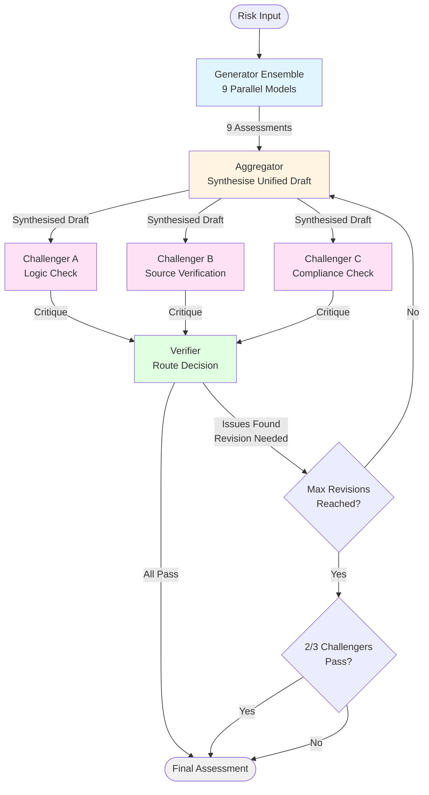
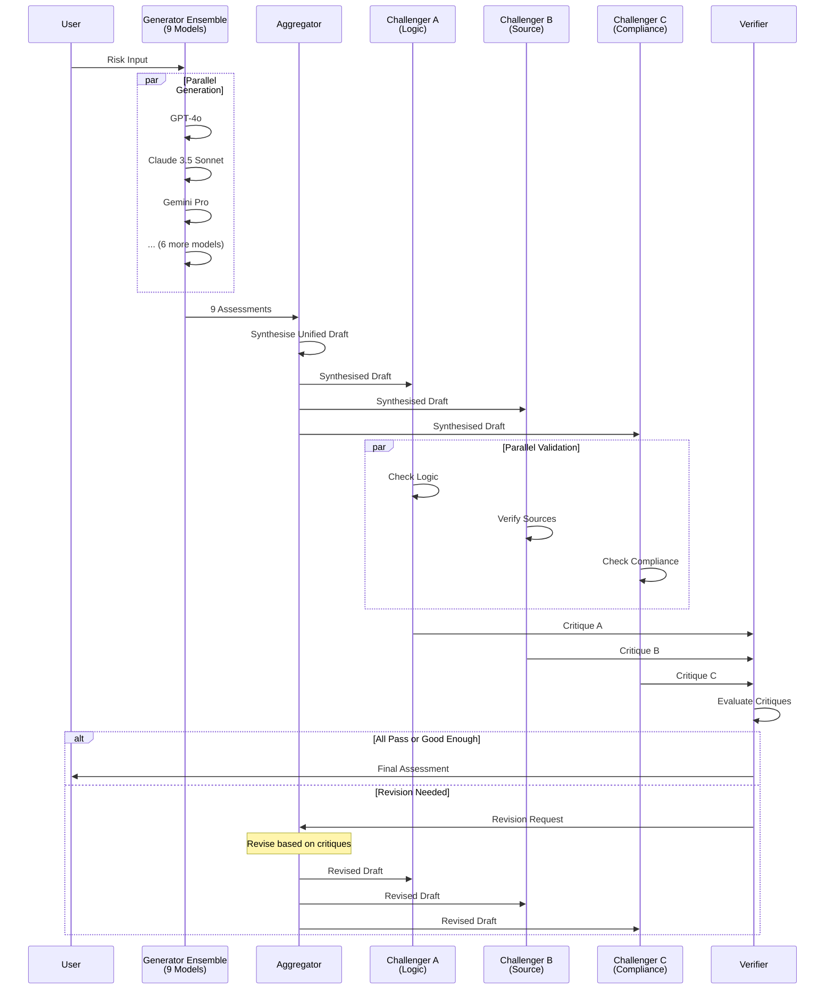

# IoT Risk Assessment Multi-Agent System

Created: 2025-12-02

A Reasoning-First Multi-Agent System for IoT Risk Assessment using LangGraph, implementing a "Heterogeneous Sequential Debate" architecture.


## Meta-Context

This project was developed as part of the **PPE Capstone - IoT Group** (November 2025) and serves as a strategic advisory document for the **Centre for Strategy & Evaluation Services (CSES)**. 

### The Problem: The "Expert Gap"

Traditional risk assessment frameworks (e.g., Djemame et al., 2011) rely on structured judgement from diverse human subject matter experts (SMEs)—engineers, lawyers, and ethicists—to interpret qualitative hazards and map them onto quantitative risk scales. However, in resource-constrained environments, access to such expert panels is often unavailable, creating an "Expert Gap" that undermines the validity of risk assessments.

**Without expert calibration**, risk scoring becomes highly susceptible to subjectivity and bias, rendering assessments methodologically invalid for regulatory purposes.

### Our Solution: Synthetic Expert Judgment

This Multi-Agent System (MAS) addresses the Expert Gap by implementing a **Reasoning-First approach to Synthetic Expert Judgment**. Unlike standard voting systems that aggregate raw numerical scores, our architecture aggregates and critiques the **Reasoning Trace** (the "Why") alongside the numerical score, enabling automated reasoning to augment regulatory capacity where human expertise is limited.

### Key Innovation

The system replaces the missing human expert panel with a heterogeneous ensemble of LLM agents that:
- Generate diverse risk assessments with explicit reasoning traces
- Cross-examine each other's reasoning through specialised challenger agents
- Synthesise consensus through iterative refinement
- Provide human-validatable reasoning trails for regulatory review

## ⚠️ Important: Production Readiness

This system is a **proof-of-concept** developed as a student capstone project. 

### What This System IS:
- ✅ A demonstration of reasoning-first multi-agent architecture
- ✅ A functional prototype producing valid risk assessments
- ✅ An extensible framework for regulatory document validation

### What This System IS NOT:
- ❌ A production-ready regulatory tool
- ❌ A substitute for professional risk assessment
- ❌ A system validated for high-volume deployment

### Transparent Fallback

The system is **architecturally designed** for the "Council of 9" - heterogeneous LLM deployment across 6 provider families (OpenAI, Anthropic, Google, DeepSeek, Groq, Mistral). When API keys are not available, it transparently falls back to OpenAI-only operation. All fallback events are logged for audit purposes.

See [LIMITATIONS.md](./LIMITATIONS.md) for complete details.

---

## Architecture

The system implements a sequential debate pipeline:

1. **Generator Ensemble** - 9 parallel models generate initial risk assessments
2. **Aggregator** - Synthesises unified draft from 9 assessments
3. **Challenger A (Logic)** - Checks internal consistency
4. **Challenger B (Source)** - Verifies external validity (regulations/CVEs)
5. **Challenger C (Safety)** - Validates compliance constraints
6. **Verifier** - Routes workflow (loop or end) based on critiques

## Key Challenges & Solutions

Implementing MAS for risk assessment introduces specific failure modes. Our design proactively mitigates these challenges:

| Challenge | The Risk | Our Solution |
|-----------|----------|--------------|
| **Hallucinated Reasoning** | Models giving the "right" score but for "wrong" reasons (invented facts or regulations) | Challenger B (Source) uses Tavily Search API to verify citations against real regulatory databases |
| **Logical Inconsistency** | High severity score justified by weak or irrelevant arguments | Challenger A (Logic) checks internal consistency and score-argument alignment |
| **Echo Chambers** | All agents agreeing due to shared underlying training data | Explicit use of distinct model families (Claude vs. GPT vs. Llama) for Generator vs. Challenger roles |
| **Quality vs. Quantity** | Raw vote counting ignores argument quality | Aggregator prioritises quality of argument over raw count of votes, synthesising reasoning traces |
| **Infinite Loops** | Revision cycles continuing indefinitely | Verifier ends workflow when ≥2/3 challengers pass (approved with reserved opinions). Falls back to MAX_REVISIONS=3 limit if 2/3 majority is never reached. |

### System Workflow Diagram



### Component Interaction Flow



## Setup

1. Install dependencies:
```bash
pip install -r requirements.txt
```

2. Copy `.env.example` to `.env` and fill in your API keys:
```bash
cp .env.example .env
```

3. Configure API keys in `.env`:
   - OpenAI API key (for GPT-4o, o1 models)
   - Anthropic API key (for Claude models)
   - Google API key (for Gemini)
   - Tavily API key (for Challenger B search)
   - DeepSeek API key and base URL (for DeepSeek V3)
   - Groq API key (optional, for Llama models)
   - Mistral API key (optional, for Mistral models)

## Usage

```python
from src.main import run_risk_assessment

result = run_risk_assessment(
    risk_input="IoT device description and scenario..."
)
```

## Project Structure

```
.
├── src/                     # Source code
│   ├── schemas.py          # Pydantic models
│   ├── config.py            # Configuration and API keys
│   ├── graph.py             # LangGraph workflow
│   ├── main.py              # Entry point
│   ├── agents/              # Agent implementations
│   │   ├── generator_ensemble.py
│   │   ├── aggregator.py
│   │   ├── challenger_a.py
│   │   ├── challenger_b.py
│   │   ├── challenger_c.py
│   │   └── verifier.py
│   └── utils/               # Utility functions
│       ├── citation_parser.py
│       ├── search_helpers.py
│       └── prompt_templates.py
├── scripts/                 # Utility scripts
│   ├── show_results.py      # Run assessment and show results
│   ├── cost_estimator.py    # Estimate operation costs
│   ├── measure_time.py      # Measure execution time
│   └── ...
├── examples/                # Example test scripts
│   ├── test_full_workflow.py
│   └── test_individual_agents.py
├── docs/                    # Documentation
│   ├── API_KEYS.md         # API key documentation
│   ├── IMPROVEMENTS_SUMMARY.md
│   └── revision_analysis.md
└── requirements.txt
```

## Testing

Run the test scripts:
```bash
# Full workflow test
python examples/test_full_workflow.py

# Show results with formatted output
python scripts/show_results.py

# Measure execution time
python scripts/measure_time.py

# Cost estimation
python scripts/cost_estimator.py
```

## Models Used

- **Generator Ensemble**: gpt-4o, gpt-4o-mini, o1-mini, claude-3-5-sonnet-20241022, claude-3-opus-20240229, gemini-1.5-pro, deepseek-chat, llama-3.3-70b-versatile, mistral-large-latest (9 models across 6 provider families)
- **Aggregator**: claude-3-5-sonnet-20241022 (Anthropic)
- **Challenger A**: gpt-4o (OpenAI - logic consistency checking)
- **Challenger B**: claude-3-5-sonnet-20241022 (Anthropic - source verification with Tavily Search API)
- **Challenger C**: gemini-1.5-pro (Google - compliance validation)
- **Verifier**: claude-3-5-sonnet-20241022 (Anthropic)

---

## Technical Design Decisions

### Core Architecture Choices

**Orchestration Framework**: LangGraph provides stateful workflows with conditional routing, enabling natural implementation of revision loops and parallel execution.

**State Management**: `TypedDict` with `Annotated[List[Critique], operator.add]` handles concurrent updates from parallel challengers safely.

**Generator Ensemble**: 9 heterogeneous models across 6 provider families (OpenAI: GPT-4o, GPT-4o-mini, O1-mini; Anthropic: Claude 3.5 Sonnet, Claude 3 Opus; Google: Gemini 1.5 Pro; DeepSeek: DeepSeek Chat; Groq: Llama 3.3 70B; Mistral: Mistral Large) run in parallel to generate diverse assessments with reasoning traces. Temperature set to `0.0` for deterministic output.

**Aggregator**: Dual-mode operation—initial synthesis combines 9 assessments; revision mode actively addresses challenger critiques. Uses Claude 3.5 Sonnet (Anthropic) for synthesis quality.

**Challenger Architecture**: Three specialised validators run in parallel, each using different provider families to prevent echo chambers:
- **Challenger A (Logic)**: GPT-4o (OpenAI) checks internal consistency and score-argument alignment
- **Challenger B (Source)**: Claude 3.5 Sonnet (Anthropic) with Tavily Search API verifies external citations
- **Challenger C (Compliance)**: Gemini 1.5 Pro (Google) validates regulatory compliance

**Verifier**: Routes workflow and ends when ≥2/3 challengers pass (approved with reserved opinions). Falls back to MAX_REVISIONS=3 limit if 2/3 majority is never reached.

**Data Validation**: Pydantic V2 ensures type safety with strict validation (scores 1-5, confidence 0.0-1.0).

**Execution Model**: Hybrid async/sync—async LLM calls within synchronous LangGraph nodes using `asyncio.run()` and `asyncio.gather()` for parallel execution.

**Revision Strategy**: Aggregator-centric revision (not generator re-run) for efficiency and targeted improvement.

---

## Performance & Cost

### Execution Time
- **One-time pass**: ~2-3 minutes
- **With 3 revisions**: ~2-4 minutes (typical: ~2 minutes)
- **Bottleneck**: Generator Ensemble (9 models in parallel, limited by slowest)

### Cost per Operation
- **Typical (3 revisions)**: ~$0.80 USD (~¥5.79 CNY)
- **Optimised (1 revision)**: ~$0.52 USD (~¥3.78 CNY)
- **Perfect (no revisions)**: ~$0.38 USD (~¥2.78 CNY)

See `scripts/cost_estimator.py` for detailed cost breakdown.

---

## Human-in-the-Loop Validation

While the MAS automates the generation of arguments, the human acts as the **"Final Arbiter of Logic"**:

- **Reasoning Audit**: The Human Validator reviews the Synthesised Reasoning Trace (e.g., "Critical because of unpatched firmware vulnerability CVE-2025-XYZ") and validates alignment with real-world context.

- **Edge Case Resolution**: If Challengers identify conflicts (e.g., Safety vs. Privacy trade-offs) causing infinite loops (detected after 3 cycles), the system triggers an Escalation Path requiring human ethical judgment.

---

## Future Improvements

Potential enhancements based on usage patterns:

1. **Dynamic Model Selection**: Adjust generator ensemble based on input complexity
2. **Adaptive Revision Limits**: Increase MAX_REVISIONS for complex scenarios
3. **Caching**: Cache verified citations to reduce Tavily API calls
4. **Streaming**: Stream intermediate results for better UX
5. **Model Fine-tuning**: Fine-tune models on domain-specific risk assessments

