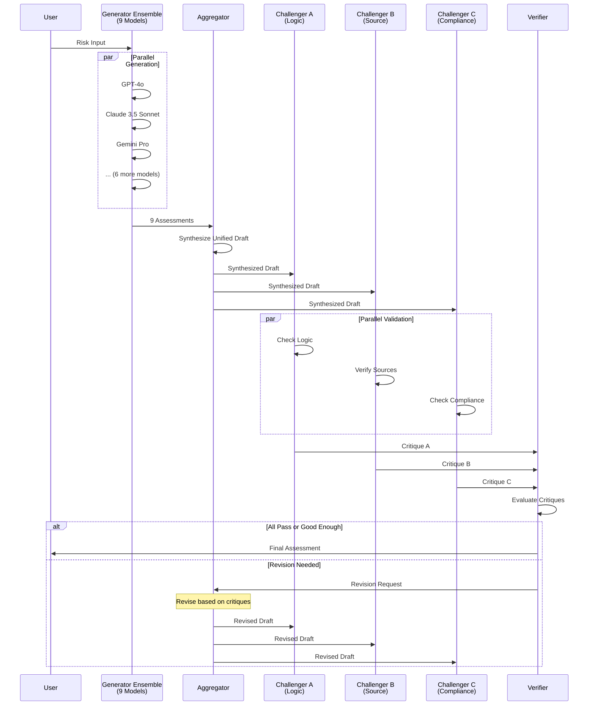

# IoT Risk Assessment Multi-Agent System

Created: 2025-12-02

A Reasoning-First Multi-Agent System for IoT Risk Assessment using LangGraph, implementing a "Heterogeneous Sequential Debate" architecture.

## Architecture

The system implements a sequential debate pipeline:

1. **Generator Ensemble** - 9 parallel models generate initial risk assessments
2. **Aggregator** - Synthesizes unified draft from 9 assessments
3. **Challenger A (Logic)** - Checks internal consistency
4. **Challenger B (Source)** - Verifies external validity (regulations/CVEs)
5. **Challenger C (Safety)** - Validates compliance constraints
6. **Verifier** - Routes workflow (loop or end) based on critiques

### System Workflow Diagram


### Component Interaction Flow



## Setup

1. Install dependencies:
```bash
pip install -r requirements.txt
```

2. Copy `.env.example` to `.env` and fill in your API keys:
```bash
cp .env.example .env
```

3. Configure API keys in `.env`:
   - OpenAI API key (for GPT-4o, o1 models)
   - Anthropic API key (for Claude models)
   - Google API key (for Gemini)
   - Tavily API key (for Challenger B search)
   - DeepSeek API key and base URL (for DeepSeek V3)
   - Groq API key (optional, for Llama models)
   - Mistral API key (optional, for Mistral models)

## Usage

```python
from src.main import run_risk_assessment

result = run_risk_assessment(
    risk_input="IoT device description and scenario..."
)
```

## Project Structure

```
.
├── src/                     # Source code
│   ├── schemas.py          # Pydantic models
│   ├── config.py            # Configuration and API keys
│   ├── graph.py             # LangGraph workflow
│   ├── main.py              # Entry point
│   ├── agents/              # Agent implementations
│   │   ├── generator_ensemble.py
│   │   ├── aggregator.py
│   │   ├── challenger_a.py
│   │   ├── challenger_b.py
│   │   ├── challenger_c.py
│   │   └── verifier.py
│   └── utils/               # Utility functions
│       ├── citation_parser.py
│       ├── search_helpers.py
│       └── prompt_templates.py
├── scripts/                 # Utility scripts
│   ├── show_results.py      # Run assessment and show results
│   ├── cost_estimator.py    # Estimate operation costs
│   ├── measure_time.py      # Measure execution time
│   └── ...
├── examples/                # Example test scripts
│   ├── test_full_workflow.py
│   └── test_individual_agents.py
├── docs/                    # Documentation
│   ├── API_KEYS.md         # API key documentation
│   ├── IMPROVEMENTS_SUMMARY.md
│   └── revision_analysis.md
└── requirements.txt
```

## Testing

Run the test scripts:
```bash
# Full workflow test
python examples/test_full_workflow.py

# Show results with formatted output
python scripts/show_results.py

# Measure execution time
python scripts/measure_time.py

# Cost estimation
python scripts/cost_estimator.py
```

## Models Used

- **Generator Ensemble**: gpt-4o, gpt-4o-mini, claude-3-5-sonnet, claude-3-opus, gemini-1.5-pro, deepseek-chat, llama-3.3-70b, mistral-large, o1-mini
- **Aggregator**: claude-3-5-sonnet-latest
- **Challenger A**: gpt-4o (logic consistency checking)
- **Challenger B**: deepseek-chat (source verification with search)
- **Challenger C**: gpt-4o (compliance validation)
- **Verifier**: claude-3-5-sonnet-latest

---

## Technical Design Decisions

This section details the intricate and nuanced technical decisions that shape the system architecture, explaining the rationale behind each choice.

### 1. Architecture Pattern: Heterogeneous Sequential Debate

**Decision**: Implement a sequential debate pipeline with heterogeneous agents rather than a single monolithic model or simple ensemble voting.

**Rationale**:
- **Diversity of Perspectives**: Each agent type (Generator, Challenger, Verifier) brings specialized capabilities, reducing single-point-of-failure risks
- **Iterative Refinement**: The revision loop allows the system to self-correct, addressing issues identified by challengers
- **Separation of Concerns**: Logic checking, source verification, and compliance validation are distinct cognitive tasks requiring different expertise
- **Quality Assurance**: Multiple validation layers ensure comprehensive risk assessment coverage

**Trade-offs**:
- ✅ **Pros**: Higher quality, self-correcting, comprehensive coverage
- ❌ **Cons**: Higher latency (~2-4 minutes), increased cost (~$0.80/operation), more complex orchestration

### 2. Orchestration Framework: LangGraph

**Decision**: Use LangGraph over alternatives (LangChain Agents, AutoGen, CrewAI, or custom orchestration).

**Rationale**:
- **Stateful Workflows**: LangGraph's `StateGraph` provides explicit state management, crucial for tracking revisions and critiques across iterations
- **Conditional Routing**: Built-in support for conditional edges enables natural implementation of revision loops
- **Type Safety**: Integration with Pydantic V2 ensures type-safe state schemas
- **Parallel Execution**: Native support for parallel node execution (challengers run concurrently)
- **State Reducers**: `Annotated[List[Critique], operator.add]` pattern elegantly handles concurrent updates from parallel challengers

**Alternative Considered**: Custom asyncio orchestration
- **Rejected**: Would require manual state management, error handling, and routing logic, increasing complexity without significant benefit

### 3. State Management: TypedDict with Annotated Reducers

**Decision**: Use `TypedDict` for state schema with `Annotated` types for concurrent-safe list operations.

**Rationale**:
- **Type Safety**: `TypedDict` provides compile-time type checking and IDE support
- **Concurrent Updates**: `Annotated[List[Critique], operator.add]` allows parallel challengers to append critiques without conflicts
- **Immutability**: Each node returns only updated fields, preventing accidental state mutations
- **Clarity**: Explicit state structure makes the workflow easier to understand and debug

**Implementation Detail**:
```python
class StateSchema(TypedDict):
    risk_input: str  # LastValue channel (immutable after initialization)
    draft_assessments: List[RiskAssessment]  # LastValue (replaced each cycle)
    synthesized_draft: Optional[RiskAssessment]  # LastValue
    critiques: Annotated[List[Critique], operator.add]  # Append-only reducer
    revision_count: int  # LastValue (incremented by verifier)
```

**Why Not Pydantic BaseModel?**: LangGraph requires `TypedDict` for state schemas, though we use Pydantic V2 for nested data models (RiskAssessment, Critique, etc.)

### 4. Generator Ensemble: 9 Heterogeneous Models

**Decision**: Use 9 diverse models in parallel rather than fewer models or a single model.

**Rationale**:
- **Model Diversity**: Each model family (OpenAI, Anthropic, Google, DeepSeek, etc.) has different strengths:
  - **GPT-4o**: Strong general reasoning, good at structured output
  - **Claude Opus**: Excellent at nuanced analysis and synthesis
  - **Gemini**: Good at technical documentation understanding
  - **DeepSeek**: Cost-effective with strong reasoning
  - **Llama 3.3**: Free tier, good baseline
  - **O1-mini**: Strong logical reasoning
- **Consensus Building**: Multiple perspectives reduce individual model biases and hallucinations
- **Fault Tolerance**: If one model fails, others provide coverage
- **Quality vs Cost**: Balance between ensemble diversity and operational cost

**Temperature Setting**: `0.0` for all generators
- **Rationale**: Risk assessment requires deterministic, analytical output. Zero temperature ensures consistency and reproducibility.

**Parallel Execution**: All 9 models run concurrently using `asyncio.gather()`
- **Performance**: Reduces total time from ~9×sequential to ~max(individual_times)
- **Bottleneck**: Total time limited by slowest model (typically Gemini with retries: ~60-120 seconds)

### 5. Aggregator: Dual-Mode Operation (Synthesis vs Revision)

**Decision**: Implement two distinct modes for Aggregator: initial synthesis and revision-based improvement.

**Rationale**:
- **Initial Synthesis**: Combines 9 diverse assessments into a unified draft, identifying consensus and strongest arguments
- **Revision Mode**: Actively addresses critiques from challengers, not just re-synthesizing
- **Prompt Engineering**: Separate prompts (`AGGREGATOR_PROMPT` vs `AGGREGATOR_REVISION_PROMPT`) ensure clear instructions for each mode

**Model Choice**: Claude 3.5 Sonnet
- **Rationale**: Excellent at synthesis tasks, strong instruction following, good at maintaining consistency across long contexts
- **Temperature**: `0.0` for deterministic synthesis

**Key Innovation**: Revision prompt explicitly instructs addressing each challenger's concerns:
- Challenger A issues → Add detailed reasoning
- Challenger C issues → Add compliance information
- Challenger B issues → Remove unverified citations

### 6. Challenger Architecture: Specialized Validators

**Decision**: Three specialized challengers rather than a single general validator.

**Rationale**:
- **Challenger A (Logic)**: Formal logic checking requires different cognitive approach than fact-checking
- **Challenger B (Source)**: External verification requires search capabilities and fact-checking expertise
- **Challenger C (Compliance)**: Regulatory knowledge requires domain-specific expertise

**Model Selection**:
- **Challenger A**: GPT-4o (originally o1-preview, but unavailable)
  - **Rationale**: Strong logical reasoning, good at identifying inconsistencies
  - **Temperature**: `0.2` (slightly creative to catch subtle logical issues)
  
- **Challenger B**: DeepSeek Chat
  - **Rationale**: Cost-effective, good at analyzing search results, strong instruction following
  - **Tool Integration**: Tavily Search API for real-time fact-checking
  - **Temperature**: `0.2` (balanced between analytical and creative analysis)
  
- **Challenger C**: GPT-4o
  - **Rationale**: Strong at regulatory compliance understanding, good at identifying gaps
  - **Temperature**: `0.2` (allows nuanced compliance assessment)

**Parallel Execution**: All three challengers run concurrently after aggregator
- **Performance**: Reduces time from ~3×sequential (~45-90s) to ~max(individual) (~15-30s)
- **State Management**: Concurrent critiques handled via `Annotated[List[Critique], operator.add]`

### 7. Verifier: Intelligent Routing with Graceful Degradation

**Decision**: Implement conditional routing with "good enough" acceptance criteria.

**Rationale**:
- **Revision Loop**: Allows system to self-correct based on challenger feedback
- **Max Revisions**: Prevents infinite loops (set to 3)
- **Graceful Degradation**: At max revisions, accepts if ≥2/3 challengers pass
  - **Rationale**: Perfect consensus may be unrealistic; majority agreement indicates acceptable quality
- **Model Choice**: Claude 3.5 Sonnet
  - **Rationale**: Strong at understanding nuanced critiques and making routing decisions
  - **Temperature**: `0.0` for deterministic routing

**Routing Logic**:
```python
if revision_count >= MAX_REVISIONS:
    if passed_challengers >= (total * 2/3):
        return "end"  # Accept "good enough"
    return "end"  # Force end regardless
elif needs_revision:
    return "revise"
else:
    return "end"
```

### 8. Data Validation: Pydantic V2

**Decision**: Use Pydantic V2 for all data models (RiskAssessment, Critique, ReasoningTrace).

**Rationale**:
- **Type Safety**: Runtime validation ensures data integrity
- **Strict Validation**: `Field(ge=1, le=5)` for scores, `Field(ge=0.0, le=1.0)` for confidence
- **JSON Serialization**: Built-in support for API responses
- **Error Handling**: Validation errors provide clear feedback
- **Performance**: V2 is significantly faster than V1

**Schema Design**:
- **ReasoningTrace**: Separates summary, arguments, citations, and vulnerabilities for structured analysis
- **RiskAssessment**: Combines score with reasoning trace, enabling challengers to validate score-argument alignment
- **Critique**: Includes confidence and recommendation, enabling nuanced routing decisions

### 9. Asynchronous vs Synchronous Execution

**Decision**: Hybrid approach - async LLM calls within synchronous LangGraph nodes.

**Rationale**:
- **LangGraph Constraint**: Nodes are synchronous functions, but LLM calls benefit from async
- **Solution**: Use `asyncio.run()` within nodes to execute async LLM calls
- **Generator Ensemble**: Uses `asyncio.gather()` for true parallel execution of 9 models
- **Challengers**: Run in parallel at LangGraph level (separate nodes), each internally async

**Trade-off**:
- ✅ **Pros**: Leverages LangGraph's orchestration while maintaining async performance
- ❌ **Cons**: Slight overhead from `asyncio.run()` wrapper, but negligible compared to LLM latency

### 10. Search Integration: Tavily API

**Decision**: Use Tavily Search API for Challenger B's external verification.

**Rationale**:
- **Real-time Verification**: Can verify current regulations and CVEs, not just training data
- **API Integration**: Simple REST API, easy to integrate with LangChain
- **Cost**: ~$0.001 per search, minimal impact on total cost
- **Quality**: Returns structured results with relevance scores

**Alternative Considered**: Serper API
- **Rejected**: Tavily provides better structured results for fact-checking use case

### 11. Error Handling and Resilience

**Decision**: Graceful degradation at multiple levels.

**Rationale**:
- **Model Failures**: Generator ensemble continues if individual models fail (returns default assessment)
- **API Errors**: Retry logic for transient failures (handled by LangChain)
- **Validation Errors**: Fallback to default values rather than crashing
- **Max Revisions**: Prevents infinite loops while allowing reasonable refinement

**Implementation**:
- Each agent has try-except blocks with sensible defaults
- Generator failures result in score=3 (neutral) with error message in reasoning
- Challenger failures result in conservative critiques (is_valid=False, low confidence)

### 12. Cost Optimization Strategies

**Decision**: Balance quality and cost through strategic model selection and revision limits.

**Rationale**:
- **Generator Ensemble**: Mix of premium (Claude Opus) and cost-effective (DeepSeek, Llama) models
- **Revision Limit**: MAX_REVISIONS=3 balances quality improvement with cost control
- **Graceful Degradation**: Accepts "good enough" assessments to avoid unnecessary revisions
- **Parallel Execution**: Reduces total time, indirectly reducing cost (faster = less waiting)

**Cost Breakdown** (per operation, 3 revisions):
- Generator Ensemble: ~$0.24 (30.6%)
- Revision Cycles: ~$0.55 (69.4%)
- **Total**: ~$0.80 USD (~¥5.79 CNY)

### 13. Prompt Engineering Philosophy

**Decision**: Explicit, structured prompts with clear output formats.

**Rationale**:
- **JSON Output**: All agents output structured JSON for reliable parsing
- **Explicit Instructions**: Clear task definitions reduce ambiguity
- **Context-Aware**: Revision prompts include previous assessment and critiques
- **Evaluation Guidelines**: Challenger prompts include criteria for "minor vs significant" issues

**Key Patterns**:
- **Generator**: Structured risk assessment with reasoning trace
- **Aggregator**: Synthesis instructions with consensus identification
- **Challengers**: Specific validation criteria with JSON critique format
- **Verifier**: Routing decision with revision focus areas

### 14. Revision Loop Design

**Decision**: Aggregator-centric revision (not generator re-run).

**Rationale**:
- **Efficiency**: Re-running 9 generators would be expensive and slow
- **Targeted Improvement**: Aggregator can focus on specific issues identified by challengers
- **Context Preservation**: Previous assessment provides baseline for incremental improvement
- **Iterative Refinement**: Each revision builds on previous attempts

**Flow**:
1. Initial: Generator Ensemble → Aggregator → Challengers → Verifier
2. Revision: Aggregator (with critiques) → Challengers → Verifier
3. Repeat until: All pass OR max revisions OR "good enough"

### 15. Performance Characteristics

**Decision**: Acceptable latency (~2-4 minutes) for high-quality output.

**Rationale**:
- **Quality Priority**: Risk assessment requires thoroughness over speed
- **Parallelization**: Maximizes parallelism where possible (generators, challengers)
- **Bottlenecks**: Generator ensemble (60-120s) is unavoidable but acceptable
- **Optimization**: Could reduce models or use faster alternatives, but at quality cost

**Typical Timing**:
- Generator Ensemble: 60-120 seconds
- Per Revision Cycle: 30-60 seconds
- **Total** (3 revisions): ~2-4 minutes

---

## Performance & Cost

### Execution Time
- **One-time pass**: ~2-3 minutes
- **With 3 revisions**: ~2-4 minutes (typical: ~2 minutes)
- **Bottleneck**: Generator Ensemble (9 models in parallel, limited by slowest)

### Cost per Operation
- **Typical (3 revisions)**: ~$0.80 USD (~¥5.79 CNY)
- **Optimized (1 revision)**: ~$0.52 USD (~¥3.78 CNY)
- **Perfect (no revisions)**: ~$0.38 USD (~¥2.78 CNY)

See `scripts/cost_estimator.py` for detailed cost breakdown.

---

## Future Improvements

Potential enhancements based on usage patterns:

1. **Dynamic Model Selection**: Adjust generator ensemble based on input complexity
2. **Adaptive Revision Limits**: Increase MAX_REVISIONS for complex scenarios
3. **Caching**: Cache verified citations to reduce Tavily API calls
4. **Streaming**: Stream intermediate results for better UX
5. **Model Fine-tuning**: Fine-tune models on domain-specific risk assessments

