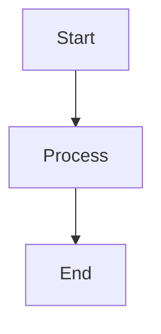
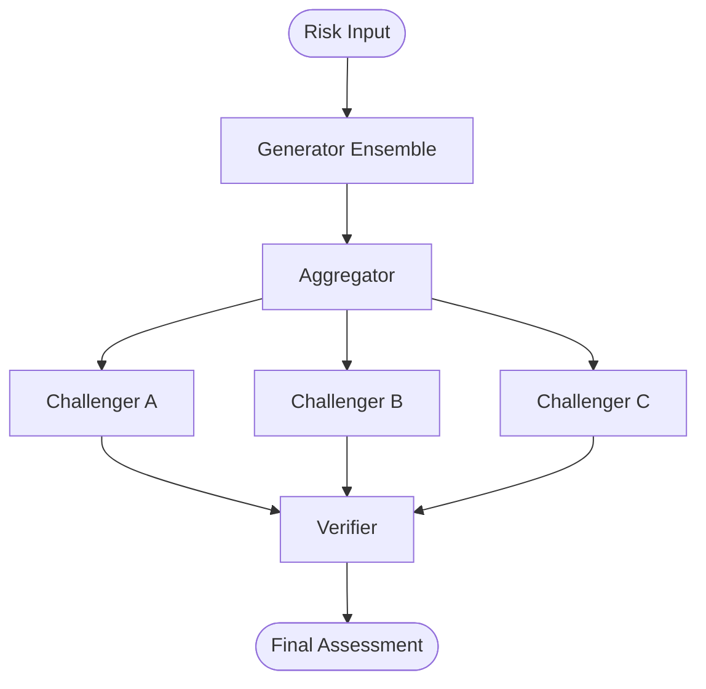
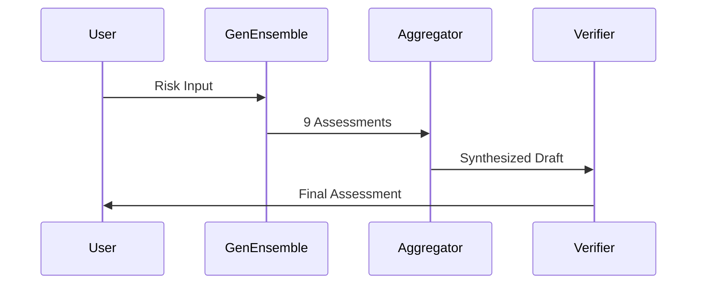
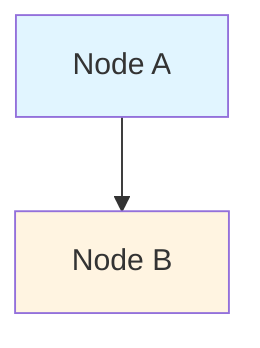
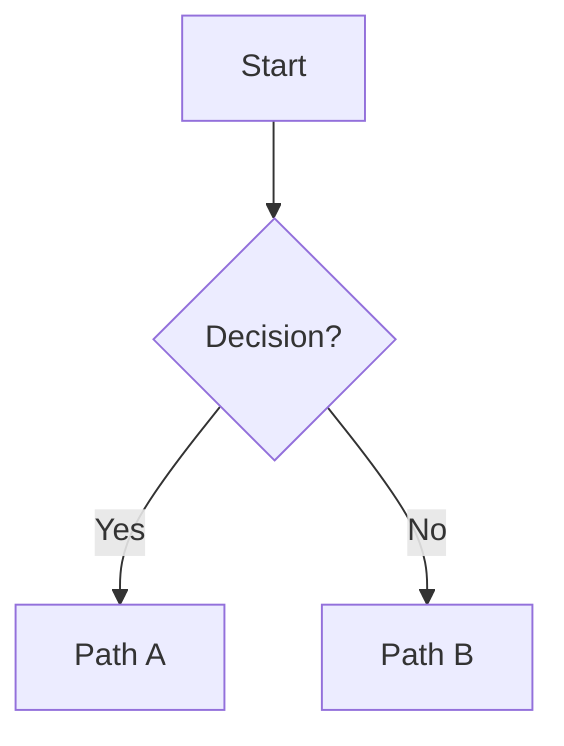
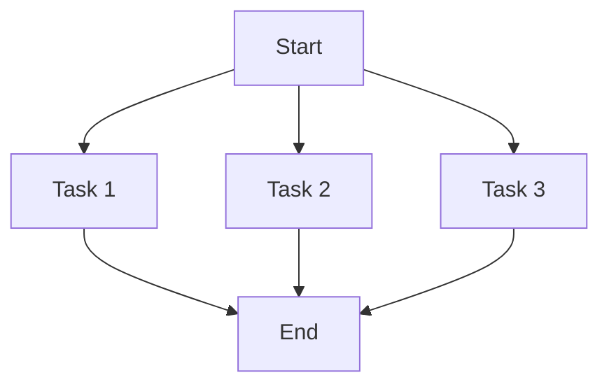
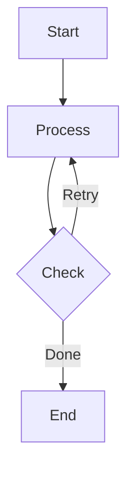

# How to Add Diagrams to README

## Overview

GitHub supports **Mermaid diagrams** natively in Markdown files. Mermaid is a diagramming and charting tool that uses text-based syntax to create diagrams.

## Supported Diagram Types

GitHub supports these Mermaid diagram types:
- Flowcharts (graph, flowchart)
- Sequence diagrams
- Class diagrams
- State diagrams
- Entity Relationship diagrams
- User Journey diagrams
- Gantt charts
- Pie charts
- Git graphs
- And more...

## Syntax

Wrap your Mermaid code in a code block with `mermaid` language identifier:

````markdown

````

## Examples in This Project

### 1. System Workflow Diagram (Flowchart)

Shows the complete workflow with decision points:



### 2. Sequence Diagram

Shows the interaction between components over time:



## Styling

You can style nodes in flowcharts:



## Common Patterns

### Decision Points



### Parallel Execution



### Loops



## Tips

1. **Keep it Simple**: Complex diagrams can be hard to read
2. **Use Labels**: Clear labels make diagrams understandable
3. **Consistent Styling**: Use consistent colors for similar components
4. **Test Locally**: Use [Mermaid Live Editor](https://mermaid.live/) to preview
5. **Version Control**: Mermaid diagrams are text-based, so they work great with Git

## Tools

- **Mermaid Live Editor**: https://mermaid.live/ (preview and edit)
- **Mermaid Documentation**: https://mermaid.js.org/
- **GitHub Support**: https://docs.github.com/en/get-started/writing-on-github/working-with-advanced-formatting/creating-diagrams

## Alternative: Images

If you need more complex diagrams, you can also:

1. Create diagrams using tools like:
   - Draw.io / diagrams.net
   - PlantUML
   - Excalidraw
   - Lucidchart

2. Export as PNG/SVG

3. Add to repository in `docs/images/`

4. Reference in README:
   ```markdown
   
   ```

## Best Practices

1. **Place diagrams near relevant text**: Don't put all diagrams at the top
2. **Add captions**: Use text above/below to explain the diagram
3. **Keep updated**: Update diagrams when architecture changes
4. **Accessibility**: Ensure diagrams are readable in both light and dark modes

